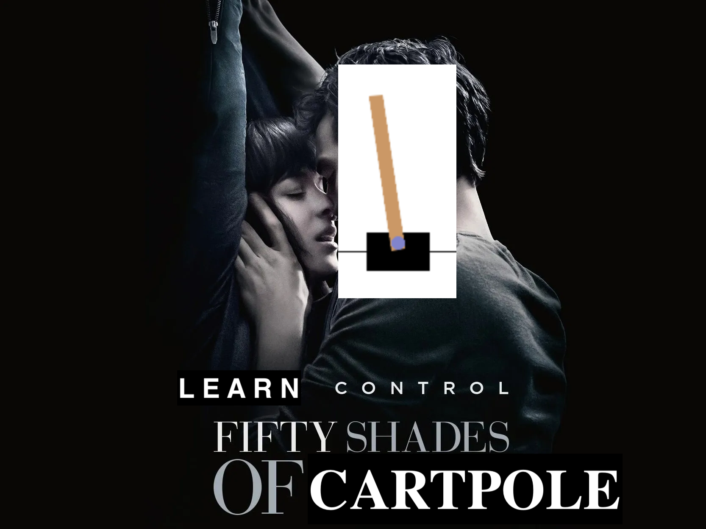
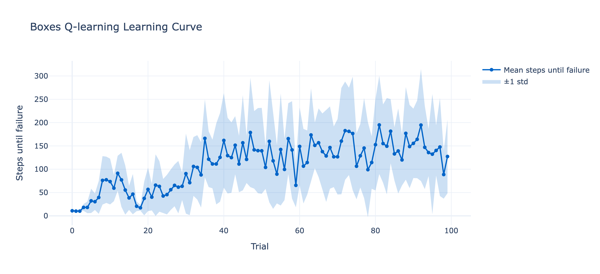
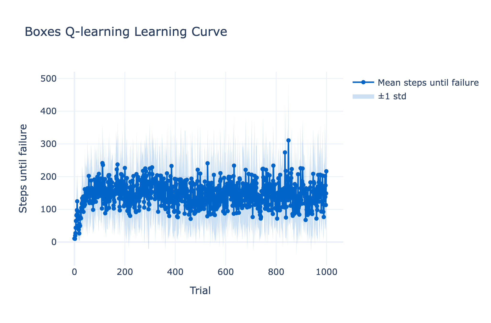

# 50 shades of cartpole
NMM 2026 final project: RL vs classical control methods for cartpole.
[This spreadsheet](https://docs.google.com/spreadsheets/d/1qUzuzJ2d2wACyRdAANu_JexWEW6xBzRqvHZk63TVAFM/edit?gid=184273463#gid=184273463) has an overview of the results!

... I'm sorry you had to see that.

# But first, a random baseline...
For the discrete action space, randomly choosing an action (0 or 1) yields 17.70 ± 4.31 steps after 100 trials.

# Search
## [Pure random search](pure_random_search/main.ipynb)
Here we randomly initialize a weight vector $w$ and roll out a trajectory (trial/episode) with it. If that trajectory produced the highest reward we've seen so far, we keep that $w$ as our best $w$, otherwise we do nothing. Then we randomly sample another $w$ vector and try again, and so on and so forth.

65.44 ± 111.25 steps, taking the best of 10 models after 1000 rollouts per model.

# Classical control
## [PID](pid/PID.ipynb)
### P (proportional) on pole angle
Take the error of the pole angle (relative to 0, the goal), multiply that by the gain (hand-tuned), and output action based on the sign of the controller output.

Incredibly simple to write, no learning, no model state... dead simple. 
Doesn't do very well though (but better than random): 48.00 ± 10.58 after 10 repeats of 100 trials.

### PD (proportional + derivative) on pole angle
Do the same thing as the P (proportional) controller except add another term that multiplies a gain by the change in error from the previous iteration to this one. Same as before, action is 1 if the control output is negative, otherwise 0.

Not much more code than the P controller, no learning, only needs to keep track of the last error. And, it SOLVES CARTPOLE! 500.00 ± 0.00 steps (the max for this Cartpole env) straight out of the box (notably I used someone else's hand-tuned gain).
I didn't even need to add a separate PD controller for the cart position, or the I term!

## [LQR](lqr/LQR.ipynb)
Sort of like a generalization of PID in that we are now computing an optimal gain *matrix* $K$, but not like PID in that we compute this optimal gain matrix from the dynamics model. In order to do this we have to linearize our state (basically, approximate the sines and cosines in our dynamics equations with constants) and agree that what we mean by "optimal" is "minimum of a quadratic cost function that balances performance (error in pole angle) against efficiency (actuator effort). I go into a lot more detail in the notebook itself, and even still I don't think I fully understand the variational calculus involved.

This performs really well out of the box (500.00 ± 0.00), just like the PD controller! Though I have to imagine it's actually *better* than a PD controller, and cartpole is just too easy...

# Reinforcement learning
## [Tabular Q-learning](q_learning/q_learning.ipynb)
Keep a lookup table of Q values, Q(s,a), where each Q value represents *the expected total (discounted) future reward you'll get if you take action a in state s, and then act optimally forever after*.
As the name implies, we've gotta discretize any pesky continuous observations into boxes first.

Here's the results on 100 trials:
 (122.80 ± 35.87 steps, evaluated over 1000 trials)

Turns out, doesn't work that well with a small number of trials. Was quite finicky to tune as well, and probably I could have tuned it more.

Here's the results on 1000 trials:
 (305.35 ± 112.35 steps, evaluated over 1000 trials)
Interestingly, the learning seems to plateau after 200 or so trials, and the agent never gets much better than the 200/300 steps range.

## [Deep Q-learning](dqn/DQN.ipynb)
Just like tabular Q learning, except we use a NN (I used a baby 3-layer MLP with ReLU activations, hidden state 128) to replace the Q table. Two big ideas:
1. Keep an experience replay buffer from which, in each iter, we sample a small batch and do SGD to update our NN. 
2. Keep a separate NN for computing the target value (Q^(s, a; w-)), which we update less frequently than the one we use to predict our action (Q^(s, a; w)). This prevents instability (literally, trying to hit a moving target!)

## [ASE / ACE](ase_ace/ASE_ACE.ipynb) (Sutton & Barto, 1983)
Ancestor of modern actor-critic methods! From RL legends, Sutton & Barto.
Discretizes the observation into 162 "boxes", specified by a preivous work by Michie & Chambers.
ASE stands for Associative Search Element; produces control action from the one-hot box vector + reinforcement signal (external or internal).
ACE stands for Adaptive Critic Element;
helps with credit assignment by computing internal reward / reinforcement signal from the box vector (state representation) + sparse external reinforcement signal (-1 if failure, 0 otherwise).

Doesn't do as well as the paper suggests, probably because the box discretization is tuned for their specific simulation (equations at the end of the paper), which OpenAI Gym doesn't reproduce exactly -- [OpenAI's Gym environment for cartpole](https://github.com/openai/gym/blob/master/gym/envs/classic_control/cartpole.py) is frictionless, whereas the simulation from Sutton & Barto includes friction of the cart on the track as well as friction of the pole on the cart.

Also, for what it's worth this was a fairly complicated implementation.