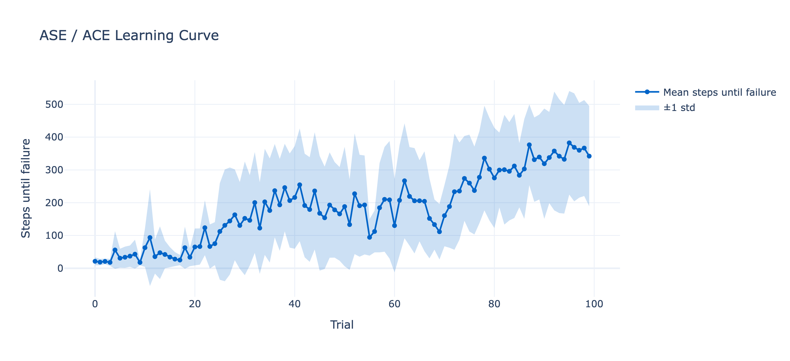

# 50_shades_of_cartpole
NMM 2026 final project: RL vs classical control methods for cartpole
[This spreadsheet](https://docs.google.com/spreadsheets/d/1qUzuzJ2d2wACyRdAANu_JexWEW6xBzRqvHZk63TVAFM/edit?gid=184273463#gid=184273463) has an overview of the results!

# But first, a random baseline...
For the discrete action space, randomly choosing an action (0 or 1) yields 17.70 ± 4.31 steps after 100 trials.

# Classical control
## [PID](pid/PID.ipynb)
### P (proportional) on pole angle
Take the error of the pole angle (relative to 0, the goal), multiply that by the gain (hand-tuned), and output action based on the sign of the controller output.

Incredibly simple to write, no learning, no model state... dead simple. 
Doesn't do very well though (but better than random): 48.00 ± 10.58 after 10 repeats of 100 trials.

### PD (proportional + derivative) on pole angle
Do the same thing as the P (proportional) controller except add another term that multiplies a gain by the change in error from the previous iteration to this one. Same as before, action is 1 if the control output is negative, otherwise 0.

Not much more code than the P controller, no learning, only needs to keep track of the last error. And, it SOLVES CARTPOLE! 500.00 ± 0.00 steps (the max for this Cartpole env) straight out of the box (notably I used someone else's hand-tuned gain).
I didn't even need to add a separate PD controller for the cart position, or the I term!

# Reinforcement learning
## [ASE / ACE](ase_ace/ASE_ACE.ipynb) (Sutton & Barto, 1983)
Ancestor of modern actor-critic methods! From RL legends, Sutton & Barto.
Discretizes the observation into 162 "boxes", specified by a preivous work by Michie & Chambers.
ASE stands for Associative Search Element; produces control action from the one-hot box vector + reinforcement signal (external or internal).
ACE stands for Adaptive Critic Element;
helps with credit assignment by computing internal reward / reinforcement signal from the box vector (state representation) + sparse external reinforcement signal (-1 if failure, 0 otherwise).

Doesn't do as well as the paper suggests, probably because the box discretization is tuned for their specific simulation (equations at the end of the paper), which OpenAI Gym doesn't reproduce exactly.
Also, a fairly complicated implementation.